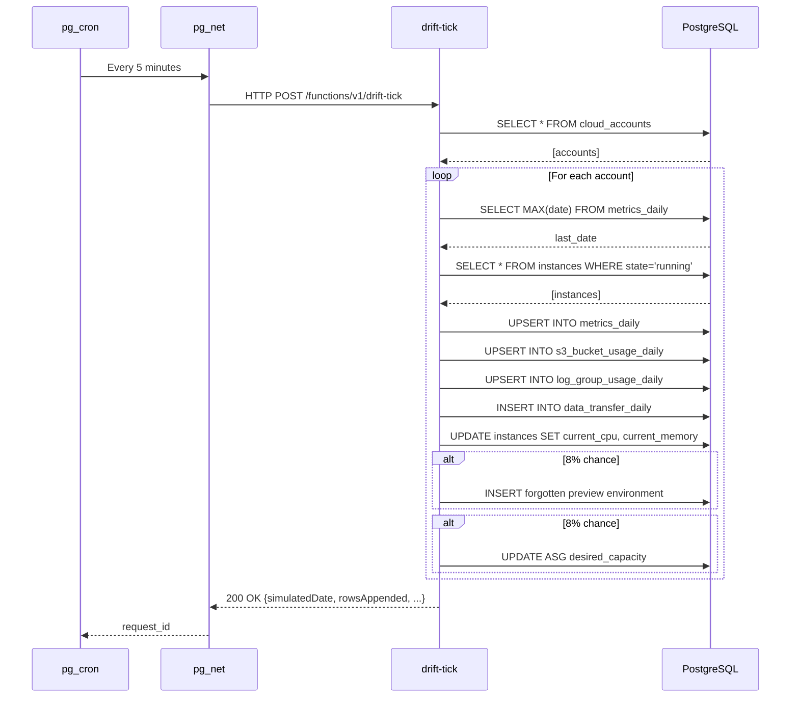
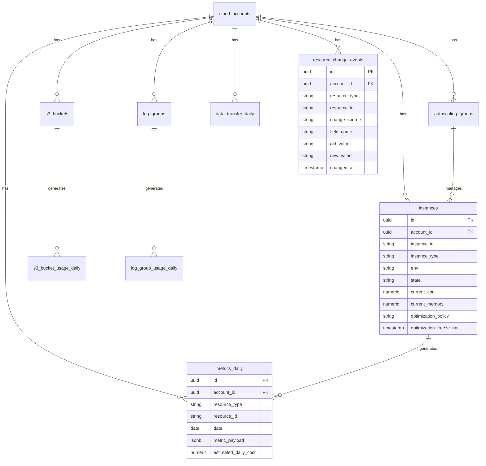
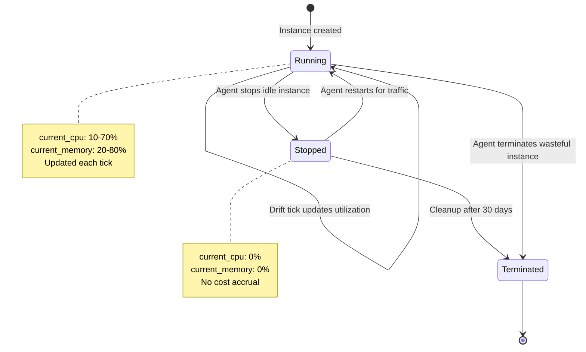

# Drift Engine Architecture

## What is the Drift Engine?

The **drift-tick** function is a "world simulator" for a fake AWS cloud environment. It creates realistic, evolving cloud infrastructure data that an AI agent can analyze and optimize.

Think of it like a video game engine that advances the game world - except instead of moving NPCs, it's simulating cloud costs, resource utilization, and infrastructure changes.

---

## Why Do We Need It?

Without drift-tick, the seeded database would be **static**. An AI agent would:
1. Analyze the data once
2. Make recommendations
3. Have nothing left to do

With drift-tick running every 5 minutes:
- Costs gradually increase (giving the AI something to optimize)
- New "waste" appears (forgotten preview environments, over-provisioned resources)
- Utilization patterns change (weekend dips, production spikes)
- The AI always has meaningful work

---

## High-Level Architecture

```
┌─────────────────────────────────────────────────────────────────────┐
│                         SUPABASE PROJECT                            │
├─────────────────────────────────────────────────────────────────────┤
│                                                                     │
│  ┌──────────────┐     ┌──────────────┐     ┌──────────────────┐   │
│  │   pg_cron    │────>│   pg_net     │────>│  drift-tick      │   │
│  │  (scheduler) │     │ (HTTP client)│     │  (Edge Function) │   │
│  └──────────────┘     └──────────────┘     └────────┬─────────┘   │
│                                                      │              │
│        Every 5 minutes, pg_cron triggers             │              │
│        an HTTP POST to the Edge Function             │              │
│                                                      ▼              │
│                                            ┌──────────────────┐    │
│                                            │    PostgreSQL    │    │
│                                            │    Database      │    │
│                                            │                  │    │
│                                            │  - instances     │    │
│                                            │  - metrics_daily │    │
│                                            │  - s3_buckets    │    │
│                                            │  - log_groups    │    │
│                                            │  - etc...        │    │
│                                            └──────────────────┘    │
│                                                                     │
└─────────────────────────────────────────────────────────────────────┘
```

---

## The Three Components

### 1. pg_cron (Scheduler)

**What it is:** A PostgreSQL extension that runs SQL commands on a schedule (like Linux cron).

**Our configuration:**
```sql
SELECT cron.schedule(
  'drift-tick-simulator',  -- Job name
  '*/5 * * * *',           -- Every 5 minutes
  $$ ... SQL command ... $$
);
```

**The cron expression `*/5 * * * *` means:**
```
*/5  = Every 5 minutes (0, 5, 10, 15, 20, 25, 30, 35, 40, 45, 50, 55)
*    = Every hour
*    = Every day of month
*    = Every month
*    = Every day of week
```

### 2. pg_net (HTTP Client)

**What it is:** A PostgreSQL extension that makes HTTP requests from within the database.

**How we use it:**
```sql
SELECT net.http_post(
  url := 'https://PROJECT.supabase.co/functions/v1/drift-tick',
  headers := jsonb_build_object('Content-Type', 'application/json'),
  body := jsonb_build_object('triggered_by', 'pg_cron')
);
```

**Why this approach?**
- Edge Functions can't be called directly from pg_cron
- pg_net bridges the gap by making an HTTP request
- The function runs in Deno (JavaScript/TypeScript runtime)

### 3. drift-tick Edge Function

**What it is:** A Supabase Edge Function written in TypeScript that runs on Deno.

**Location:** `supabase/functions/drift-tick/index.ts`

**Runtime:** Deno (serverless, boots in ~30ms, shuts down after execution)

---

## What Happens Each Tick

When drift-tick runs, it simulates **ONE virtual day** for each cloud account:

```
Real Time              Virtual Time (in database)
─────────────────────────────────────────────────
Tick 1 (10:00 AM)  →   Simulates 2026-01-17
Tick 2 (10:05 AM)  →   Simulates 2026-01-18
Tick 3 (10:10 AM)  →   Simulates 2026-01-19
...
Tick 288 (34 hours later) → Simulates 2027-01-17 (one year!)
```

**Key insight:** 5-minute real intervals = 1-day virtual intervals. This means:
- 1 hour real time = 12 virtual days
- 1 day real time = 288 virtual days (~10 months)
- The AI sees a full year of data evolution in ~1.25 real days

---

## The Execution Flow

```
┌─────────────────────────────────────────────────────────────────┐
│                    drift-tick Execution Flow                     │
└─────────────────────────────────────────────────────────────────┘

1. DETERMINE NEXT VIRTUAL DAY
   │
   │  Query: SELECT MAX(date) FROM metrics_daily WHERE account_id = ?
   │  Result: 2026-01-16
   │  Next day: 2026-01-17
   │
   ▼
2. DRIFT INSTANCE COSTS
   │
   │  For each running instance:
   │    - Get yesterday's cost
   │    - Apply random walk (-3% to +5%)
   │    - Add prod bias (+2% for production)
   │    - Apply weekend discount (70-85% for non-prod)
   │    - Insert into metrics_daily
   │
   ▼
3. DRIFT S3 USAGE
   │
   │  For each bucket:
   │    - Get yesterday's storage amounts
   │    - Apply daily growth (1-3% prod, 0.3-1.5% non-prod)
   │    - Simulate lifecycle transitions (Standard → IA → Glacier)
   │    - Calculate storage costs
   │    - Insert into s3_bucket_usage_daily
   │
   ▼
4. DRIFT LOG USAGE
   │
   │  For each log group:
   │    - Simulate daily ingestion (0.5-3 GB prod, 0.1-0.8 GB non-prod)
   │    - Apply retention cap (based on retention_days setting)
   │    - Weekend reduction (70% of normal)
   │    - Insert into log_group_usage_daily
   │
   ▼
5. DRIFT DATA TRANSFER
   │
   │  Generate daily transfer records:
   │    - Cross-region transfer (us-east-1 → us-west-2)
   │    - Internet egress
   │    - Cross-AZ transfer
   │    - Insert into data_transfer_daily
   │
   ▼
6. UPDATE LIVE UTILIZATION
   │
   │  Update current_cpu and current_memory on instances:
   │    - Prod: 40-70% CPU, 50-80% memory
   │    - Preview: 2-15% CPU, 10-30% memory (forgotten!)
   │    - Dev/Staging: 15-45% CPU, 20-50% memory (near zero weekends)
   │
   ▼
7. INTRODUCE STARTUP MESS (8% probability each)
   │
   │  Maybe create forgotten preview environment:
   │    - New ASG with 4-8 instances
   │    - Instances initially busy, then idle
   │    - Log group for the preview
   │
   │  Maybe over-provision an ASG:
   │    - Pick a non-prod ASG
   │    - Increase desired_capacity by 1-2
   │
   ▼
8. RETURN RESULTS
   │
   │  {
   │    "ok": true,
   │    "simulatedDate": "2026-01-17",
   │    "accountsProcessed": 1,
   │    "rowsAppended": {
   │      "metrics_daily": 25,
   │      "s3_bucket_usage_daily": 7,
   │      "log_group_usage_daily": 12,
   │      "data_transfer_daily": 3
   │    },
   │    "scenariosTriggered": ["Over-provisioned ASG worker-asg: 2 → 3"]
   │  }
```

---

## The Algorithms

### Random Walk for Cost Drift

The core algorithm for realistic cost evolution:

```typescript
function applyRandomWalk(
  baseValue: number,      // Yesterday's cost
  minDeltaPercent: number, // e.g., -3
  maxDeltaPercent: number, // e.g., +5
  biasPercent: number = 0  // e.g., +2 for prod
): number {
  const delta = randomBetween(minDeltaPercent, maxDeltaPercent) / 100
  const biasMultiplier = 1 + biasPercent / 100
  return Math.max(0, baseValue * (1 + delta) * biasMultiplier)
}
```

**Example:**
- Yesterday's cost: $10.00
- Random delta: +3% → $10.30
- Prod bias: +2% → $10.51
- Result: $10.51 (realistic gradual increase)

**Why random walk?**
- Real cloud costs don't jump dramatically day-to-day
- They drift gradually based on usage patterns
- This creates realistic time-series data for ML models

### S3 Lifecycle Transitions

Simulates data moving through storage tiers:

```typescript
if (hasLifecycle) {
  // Move 0.5% from Standard to Infrequent Access daily
  const toIa = standardGb * 0.005
  standardGb -= toIa
  iaGb += toIa

  // Move 0.3% from IA to Glacier daily
  const toGlacier = iaGb * 0.003
  iaGb -= toGlacier
  glacierGb += toGlacier
}
```

**Result over time:**
```
Day 1:   Standard: 100 GB, IA: 0 GB, Glacier: 0 GB
Day 30:  Standard: 86 GB,  IA: 12 GB, Glacier: 2 GB
Day 90:  Standard: 64 GB,  IA: 25 GB, Glacier: 11 GB
Day 365: Standard: 16 GB,  IA: 35 GB, Glacier: 49 GB
```

### Log Retention Caps

Prevents log storage from growing infinitely:

```typescript
const retentionCaps = {
  7: 20,    // 7-day retention → max 20 GB stored
  14: 35,   // 14-day retention → max 35 GB stored
  30: 60,   // 30-day retention → max 60 GB stored
  90: 200,  // 90-day retention → max 200 GB stored
}

// Apply cap
storedGb = Math.min(storedGb, cap)
```

---

## Database Tables Involved

### Input Tables (Read by drift-tick)

| Table | Purpose |
|-------|---------|
| `cloud_accounts` | List of accounts to process |
| `instances` | EC2 instances with current state |
| `s3_buckets` | S3 buckets with lifecycle policies |
| `log_groups` | CloudWatch log groups |
| `autoscaling_groups` | ASGs with capacity settings |

### Output Tables (Written by drift-tick)

| Table | Purpose | Key Columns |
|-------|---------|-------------|
| `metrics_daily` | Daily cost metrics per resource | `resource_type`, `resource_id`, `date`, `estimated_daily_cost` |
| `s3_bucket_usage_daily` | Daily S3 storage per bucket | `bucket_id`, `date`, `storage_gb_standard`, `storage_gb_ia`, `storage_gb_glacier` |
| `log_group_usage_daily` | Daily log ingestion/storage | `log_group_id`, `date`, `ingested_gb`, `stored_gb` |
| `data_transfer_daily` | Daily data transfer records | `source_region`, `dest_region`, `direction`, `gb_transferred` |
| `resource_change_events` | Audit log of all changes | `resource_type`, `resource_id`, `change_source`, `field_name`, `old_value`, `new_value` |

### Updated Tables (Modified by drift-tick)

| Table | Columns Updated |
|-------|-----------------|
| `instances` | `current_cpu`, `current_memory`, `updated_at` |
| `autoscaling_groups` | `current_utilization`, `desired_capacity`, `updated_at` |

---

## Agent Behavior Control

The drift engine respects agent control columns:

### optimization_policy

| Value | Meaning | Drift Engine Behavior |
|-------|---------|----------------------|
| `auto_safe` | Agent can auto-optimize | Normal drift, agent can modify |
| `recommend_only` | Agent suggests, human approves | Normal drift, agent reads only |
| `ignore` | Do not touch this resource | Normal drift, agent ignores |

### freeze_optimizations_until

A timestamp that prevents agent modifications:

```sql
-- Example: Don't optimize this ASG until after the product launch
UPDATE autoscaling_groups
SET optimization_freeze_until = '2026-02-01 00:00:00'
WHERE name = 'production-api-asg';
```

The AI agent checks this before making changes:
```typescript
if (asg.optimization_freeze_until && new Date() < asg.optimization_freeze_until) {
  // Skip this resource - business has frozen it
  continue;
}
```

---

## Startup Mess Scenarios

### Forgotten Preview Environment (8% probability)

**What happens:**
1. Creates a new ASG with `env: 'preview'`
2. Spawns 4-8 instances
3. Creates a log group
4. Instances start with high CPU (40-80%) - simulating initial deployment activity
5. Over subsequent ticks, CPU drops to 2-15% - forgotten and idle

**Why this matters:**
- Real startups constantly spin up preview/feature environments
- Engineers forget to tear them down
- These become "ghost costs" the AI should detect

### Over-Provisioned ASG (8% probability)

**What happens:**
1. Picks a random non-prod ASG
2. Increases `desired_capacity` by 1-2
3. Logs the change in `resource_change_events`

**Why this matters:**
- Simulates someone manually scaling up for a test/demo
- Forgetting to scale back down
- AI should notice the over-provisioning

---

## Idempotency

The drift engine is designed to be **idempotent** - running it twice in a row won't corrupt data:

```typescript
// Uses upsert with onConflict to prevent duplicates
const { error } = await supabase
  .from('metrics_daily')
  .upsert(metricsRows, {
    onConflict: 'resource_type,resource_id,date',
    ignoreDuplicates: true
  })
```

**What this means:**
- If pg_cron accidentally fires twice at the same minute
- The second run will try to insert the same date
- The conflict handler will silently ignore the duplicates
- No data corruption

---

## Monitoring & Debugging

### View Scheduled Jobs

```sql
SELECT * FROM cron.job;
```

### View Execution History

```sql
SELECT
  jobid,
  runid,
  job_pid,
  status,
  return_message,
  start_time,
  end_time
FROM cron.job_run_details
ORDER BY start_time DESC
LIMIT 10;
```

### View Edge Function Logs

Supabase Dashboard → Edge Functions → drift-tick → Logs

### View Recent Changes

```sql
SELECT * FROM resource_change_events
ORDER BY changed_at DESC
LIMIT 20;
```

### Check Virtual Time Progress

```sql
SELECT
  MIN(date) as earliest_date,
  MAX(date) as latest_date,
  COUNT(DISTINCT date) as total_days_simulated
FROM metrics_daily;
```

---

## Mermaid Diagrams

### Sequence Diagram



### Entity Relationship Diagram



### State Machine: Instance Lifecycle



---

## Cost Formulas

### Instance Daily Cost

```
daily_cost = hourly_cost × 24 × random_walk(-3%, +5%) × prod_bias × weekend_factor

Where:
- hourly_cost: Based on instance type (e.g., t3.micro = $0.0104/hr)
- prod_bias: 1.02 for prod, 1.0 otherwise
- weekend_factor: 0.7-0.85 for non-prod on weekends, 1.0 otherwise
```

### S3 Daily Cost

```
storage_cost = (standard_gb × $0.023/30) + (ia_gb × $0.0125/30) + (glacier_gb × $0.004/30)
request_cost = request_count × $0.0000004

total_daily_cost = storage_cost + request_cost
```

### Log Daily Cost

```
ingestion_cost = ingested_gb × $0.50
storage_cost = stored_gb × $0.03/30

total_daily_cost = ingestion_cost + storage_cost
```

### Data Transfer Cost

```
cross_region_cost = gb_transferred × $0.02
egress_cost = gb_transferred × $0.09
cross_az_cost = gb_transferred × $0.01
```

---

## Summary

The drift engine is the heartbeat of the simulated AWS environment. Every 5 minutes, it:

1. **Advances time** by one virtual day
2. **Evolves costs** using random walk algorithms
3. **Creates waste** through realistic "startup mess" scenarios
4. **Updates utilization** to reflect realistic patterns
5. **Logs everything** for the AI agent to analyze

This creates a living, breathing cloud environment where an AI agent always has meaningful optimization work to do - just like a real cloud environment at a growing startup.
