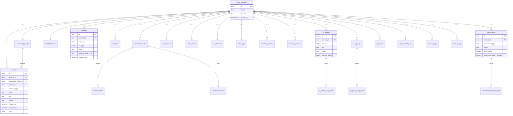

# feat: AWS Cloud Environment Supabase Schema Implementation

## Overview

Build a fake AWS cloud environment in Supabase/PostgreSQL that simulates AWS infrastructure for cost optimization scenarios. This schema will serve as the data plane for an Agentic AI platform to discover resources, detect waste, and simulate optimization actions.

**Date**: January 15, 2025
**Project**: aws-environment
**Supabase Project Ref**: `vqcvrwkdvxzgucqcfcoq`

## Problem Statement / Motivation

FinOps (Cloud Financial Operations) teams spend significant time manually identifying and optimizing cloud waste. This project creates a realistic sandbox environment where:

1. An Agentic AI platform can learn to detect cloud waste patterns
2. A Drift Engine can continuously introduce new resources, idle workloads, and zombie storage
3. Cost optimization scenarios can be simulated safely without affecting real infrastructure

The environment mirrors AWS concepts (EC2, EBS, S3, RDS, Lambda, etc.) while storing all data in Supabase/PostgreSQL tables.

## Proposed Solution

Create 26 PostgreSQL tables organized by domain:

| Domain | Tables | Purpose |
|--------|--------|---------|
| Compute | 6 | EC2 instances, autoscaling, containers, Lambda |
| Storage | 4 | EBS volumes, snapshots, S3 buckets |
| Databases & Caches | 2 | RDS, ElastiCache |
| Networking | 3 | Load balancers, Elastic IPs, data transfer |
| Managed Services | 2 | OpenSearch, Kinesis/Kafka |
| Observability | 2 | CloudWatch log groups |
| Commitments | 2 | Reserved Instances, Savings Plans |
| Governance | 2 | Resource tags, metrics rollup |
| Container Services | 1 | ECS/EKS deployments |
| API Access | 1 | IAM-style API clients |

## Technical Approach

### Architecture

All tables use consistent patterns:
- **UUID primary keys** via `gen_random_uuid()`
- **timestamptz** for all timestamps with `created_at`/`updated_at`
- **JSONB** for flexible metadata (tags, configs, metrics)
- **numeric** for cost fields to avoid floating-point precision issues
- **Foreign keys** with appropriate ON DELETE behaviors
- **Indexes** on all FK columns and common query patterns

### Entity Relationship Diagram



### Implementation Phases

#### Phase 1: Foundation Tables
Create the root and lookup tables that other tables depend on.

**Tables:**
- `cloud_accounts` - Root tenant/account table

**SQL Migration: `001_create_cloud_accounts.sql`**
```sql
-- Cloud Accounts: Root table representing AWS-like accounts
create table cloud_accounts (
  id uuid primary key default gen_random_uuid(),
  name text not null,
  provider text not null default 'aws-fake',
  created_at timestamptz not null default now()
);

comment on table cloud_accounts is 'Logical cloud account/tenant boundary, mirrors AWS account';

-- Enable RLS for future multi-tenant support
alter table cloud_accounts enable row level security;
```

#### Phase 2: Compute Domain Tables
Create all compute-related resource tables.

**Tables:**
- `autoscaling_groups`
- `instances`
- `container_clusters`
- `container_nodes`
- `lambda_functions`

**SQL Migration: `002_create_compute_tables.sql`**
```sql
-- Autoscaling Groups: AWS Auto Scaling Groups
create table autoscaling_groups (
  id uuid primary key default gen_random_uuid(),
  account_id uuid not null references cloud_accounts(id) on delete cascade,
  name text not null,
  min_size integer not null default 0,
  max_size integer not null default 10,
  desired_capacity integer not null default 1,
  instance_type text not null,
  env text not null default 'dev',
  region text not null default 'us-east-1',
  created_at timestamptz not null default now(),
  updated_at timestamptz not null default now()
);

create index idx_autoscaling_groups_account_id on autoscaling_groups(account_id);
alter table autoscaling_groups enable row level security;

-- Instances: EC2-style virtual machines
create table instances (
  id uuid primary key default gen_random_uuid(),
  account_id uuid not null references cloud_accounts(id) on delete cascade,
  instance_id text not null unique,
  name text,
  instance_type text not null,
  env text not null default 'dev',
  region text not null default 'us-east-1',
  state text not null default 'running' check (state in ('pending', 'running', 'stopping', 'stopped', 'terminated')),
  autoscaling_group_id uuid references autoscaling_groups(id) on delete set null,
  launch_time timestamptz not null default now(),
  hourly_cost numeric(10,4) not null default 0,
  gpu_hourly_cost numeric(10,4) default 0,
  gpu_count integer default 0,
  has_gpu boolean default false,
  avg_cpu_7d numeric(5,2) default 0,
  avg_network_7d numeric(12,2) default 0,
  last_active_at timestamptz,
  tags jsonb default '{}',
  created_at timestamptz not null default now(),
  updated_at timestamptz not null default now()
);

create index idx_instances_account_id on instances(account_id);
create index idx_instances_asg_id on instances(autoscaling_group_id) where autoscaling_group_id is not null;
create index idx_instances_state on instances(state);
create index idx_instances_tags on instances using gin(tags);
alter table instances enable row level security;

-- Container Clusters: ECS/EKS/K8s clusters
create table container_clusters (
  id uuid primary key default gen_random_uuid(),
  account_id uuid not null references cloud_accounts(id) on delete cascade,
  name text not null,
  env text not null default 'dev',
  region text not null default 'us-east-1',
  node_instance_type text not null default 'm5.large',
  desired_nodes integer not null default 3,
  min_nodes integer not null default 1,
  max_nodes integer not null default 10,
  estimated_hourly_cost numeric(10,4) default 0,
  created_at timestamptz not null default now(),
  updated_at timestamptz not null default now()
);

create index idx_container_clusters_account_id on container_clusters(account_id);
alter table container_clusters enable row level security;

-- Container Nodes: Worker nodes inside clusters
create table container_nodes (
  id uuid primary key default gen_random_uuid(),
  cluster_id uuid not null references container_clusters(id) on delete cascade,
  instance_id text not null,
  instance_type text not null,
  region text not null default 'us-east-1',
  state text not null default 'running' check (state in ('running', 'stopped')),
  hourly_cost numeric(10,4) not null default 0,
  gpu_hourly_cost numeric(10,4) default 0,
  gpu_count integer default 0,
  has_gpu boolean default false,
  avg_cpu_7d numeric(5,2) default 0,
  avg_memory_7d numeric(5,2) default 0,
  created_at timestamptz not null default now(),
  updated_at timestamptz not null default now()
);

create index idx_container_nodes_cluster_id on container_nodes(cluster_id);
alter table container_nodes enable row level security;

-- Lambda Functions: Serverless functions
create table lambda_functions (
  id uuid primary key default gen_random_uuid(),
  account_id uuid not null references cloud_accounts(id) on delete cascade,
  name text not null,
  env text not null default 'dev',
  region text not null default 'us-east-1',
  memory_mb integer not null default 128,
  timeout_seconds integer not null default 30,
  provisioned_concurrency integer default 0,
  invocations_7d bigint default 0,
  avg_duration_ms_7d numeric(10,2) default 0,
  estimated_monthly_cost numeric(12,4) default 0,
  created_at timestamptz not null default now(),
  updated_at timestamptz not null default now()
);

create index idx_lambda_functions_account_id on lambda_functions(account_id);
alter table lambda_functions enable row level security;
```

#### Phase 3: Storage Domain Tables
Create storage-related resource tables.

**Tables:**
- `volumes`
- `snapshots`
- `s3_buckets`
- `s3_bucket_usage_daily`

**SQL Migration: `003_create_storage_tables.sql`**
```sql
-- Volumes: EBS-style block storage
create table volumes (
  id uuid primary key default gen_random_uuid(),
  account_id uuid not null references cloud_accounts(id) on delete cascade,
  volume_id text not null unique,
  region text not null default 'us-east-1',
  size_gib integer not null,
  volume_type text not null default 'gp3',
  state text not null default 'available' check (state in ('creating', 'available', 'in-use', 'deleting', 'deleted')),
  attached_instance_id text,
  monthly_cost numeric(10,4) not null default 0,
  last_used_at timestamptz,
  tags jsonb default '{}',
  created_at timestamptz not null default now(),
  updated_at timestamptz not null default now()
);

create index idx_volumes_account_id on volumes(account_id);
create index idx_volumes_state on volumes(state);
create index idx_volumes_attached on volumes(attached_instance_id) where attached_instance_id is not null;
alter table volumes enable row level security;

-- Snapshots: EBS snapshots/backups
create table snapshots (
  id uuid primary key default gen_random_uuid(),
  account_id uuid not null references cloud_accounts(id) on delete cascade,
  snapshot_id text not null unique,
  region text not null default 'us-east-1',
  source_volume_id text,
  size_gib integer not null,
  retention_policy text,
  monthly_cost numeric(10,4) not null default 0,
  tags jsonb default '{}',
  created_at timestamptz not null default now()
);

create index idx_snapshots_account_id on snapshots(account_id);
create index idx_snapshots_source_volume on snapshots(source_volume_id) where source_volume_id is not null;
alter table snapshots enable row level security;

-- S3 Buckets: Object storage
create table s3_buckets (
  id uuid primary key default gen_random_uuid(),
  account_id uuid not null references cloud_accounts(id) on delete cascade,
  name text not null unique,
  env text not null default 'dev',
  region text not null default 'us-east-1',
  lifecycle_policy jsonb default '{}',
  tags jsonb default '{}',
  created_at timestamptz not null default now()
);

create index idx_s3_buckets_account_id on s3_buckets(account_id);
alter table s3_buckets enable row level security;

-- S3 Bucket Usage Daily: Time-series usage metrics
create table s3_bucket_usage_daily (
  id uuid primary key default gen_random_uuid(),
  bucket_id uuid not null references s3_buckets(id) on delete cascade,
  date date not null,
  storage_gb_standard numeric(12,4) default 0,
  storage_gb_ia numeric(12,4) default 0,
  storage_gb_glacier numeric(12,4) default 0,
  requests_count bigint default 0,
  estimated_storage_cost numeric(10,4) default 0,
  estimated_request_cost numeric(10,4) default 0,
  unique(bucket_id, date)
);

create index idx_s3_bucket_usage_bucket_id on s3_bucket_usage_daily(bucket_id);
create index idx_s3_bucket_usage_date on s3_bucket_usage_daily(date desc);
alter table s3_bucket_usage_daily enable row level security;
```

#### Phase 4: Database & Cache Tables
Create database and cache resource tables.

**Tables:**
- `rds_instances`
- `cache_clusters`

**SQL Migration: `004_create_database_tables.sql`**
```sql
-- RDS Instances: Managed database instances
create table rds_instances (
  id uuid primary key default gen_random_uuid(),
  account_id uuid not null references cloud_accounts(id) on delete cascade,
  db_instance_id text not null unique,
  engine text not null default 'postgres',
  instance_class text not null default 'db.t3.micro',
  allocated_storage_gib integer not null default 20,
  env text not null default 'dev',
  region text not null default 'us-east-1',
  state text not null default 'available' check (state in ('available', 'stopped', 'starting', 'stopping', 'deleting')),
  hourly_cost numeric(10,4) not null default 0,
  storage_monthly_cost numeric(10,4) default 0,
  avg_cpu_7d numeric(5,2) default 0,
  avg_connections_7d numeric(10,2) default 0,
  created_at timestamptz not null default now(),
  updated_at timestamptz not null default now()
);

create index idx_rds_instances_account_id on rds_instances(account_id);
create index idx_rds_instances_state on rds_instances(state);
alter table rds_instances enable row level security;

-- Cache Clusters: Redis/ElastiCache clusters
create table cache_clusters (
  id uuid primary key default gen_random_uuid(),
  account_id uuid not null references cloud_accounts(id) on delete cascade,
  cluster_id text not null unique,
  engine text not null default 'redis',
  node_type text not null default 'cache.t3.micro',
  num_nodes integer not null default 1,
  env text not null default 'dev',
  region text not null default 'us-east-1',
  hourly_cost numeric(10,4) not null default 0,
  avg_cpu_7d numeric(5,2) default 0,
  avg_memory_7d numeric(5,2) default 0,
  created_at timestamptz not null default now(),
  updated_at timestamptz not null default now()
);

create index idx_cache_clusters_account_id on cache_clusters(account_id);
alter table cache_clusters enable row level security;
```

#### Phase 5: Networking Tables
Create networking and traffic tables.

**Tables:**
- `load_balancers`
- `elastic_ips`
- `data_transfer_daily`

**SQL Migration: `005_create_networking_tables.sql`**
```sql
-- Load Balancers: ELB/ALB/NLB
create table load_balancers (
  id uuid primary key default gen_random_uuid(),
  account_id uuid not null references cloud_accounts(id) on delete cascade,
  lb_arn text not null unique,
  name text not null,
  type text not null default 'application' check (type in ('application', 'network', 'gateway', 'classic')),
  env text not null default 'dev',
  region text not null default 'us-east-1',
  hourly_cost numeric(10,4) not null default 0,
  avg_request_count_7d numeric(12,2) default 0,
  created_at timestamptz not null default now(),
  updated_at timestamptz not null default now()
);

create index idx_load_balancers_account_id on load_balancers(account_id);
alter table load_balancers enable row level security;

-- Elastic IPs: Static public IP addresses
create table elastic_ips (
  id uuid primary key default gen_random_uuid(),
  account_id uuid not null references cloud_accounts(id) on delete cascade,
  allocation_id text not null unique,
  public_ip text not null,
  associated_instance_id text,
  associated_lb_arn text,
  state text not null default 'unassociated' check (state in ('associated', 'unassociated')),
  hourly_cost numeric(10,4) not null default 0,
  created_at timestamptz not null default now(),
  updated_at timestamptz not null default now()
);

create index idx_elastic_ips_account_id on elastic_ips(account_id);
create index idx_elastic_ips_state on elastic_ips(state);
alter table elastic_ips enable row level security;

-- Data Transfer Daily: Network transfer metrics
create table data_transfer_daily (
  id uuid primary key default gen_random_uuid(),
  account_id uuid not null references cloud_accounts(id) on delete cascade,
  date date not null,
  source_region text not null,
  dest_region text not null,
  direction text not null check (direction in ('intra-az', 'cross-az', 'cross-region', 'egress', 'ingress')),
  gb_transferred numeric(12,4) not null default 0,
  estimated_transfer_cost numeric(10,4) default 0
);

create index idx_data_transfer_account_id on data_transfer_daily(account_id);
create index idx_data_transfer_date on data_transfer_daily(date desc);
alter table data_transfer_daily enable row level security;
```

#### Phase 6: Managed Services & Streaming Tables
Create managed services and streaming cluster tables.

**Tables:**
- `managed_services`
- `streaming_clusters`

**SQL Migration: `006_create_managed_services_tables.sql`**
```sql
-- Managed Services: OpenSearch, feature stores, etc.
create table managed_services (
  id uuid primary key default gen_random_uuid(),
  account_id uuid not null references cloud_accounts(id) on delete cascade,
  service_type text not null,
  name text not null,
  env text not null default 'dev',
  region text not null default 'us-east-1',
  instance_type text not null,
  node_count integer not null default 1,
  hourly_cost numeric(10,4) not null default 0,
  avg_cpu_7d numeric(5,2) default 0,
  avg_memory_7d numeric(5,2) default 0,
  created_at timestamptz not null default now(),
  updated_at timestamptz not null default now()
);

create index idx_managed_services_account_id on managed_services(account_id);
alter table managed_services enable row level security;

-- Streaming Clusters: Kinesis/Kafka-style
create table streaming_clusters (
  id uuid primary key default gen_random_uuid(),
  account_id uuid not null references cloud_accounts(id) on delete cascade,
  name text not null,
  engine text not null default 'kinesis' check (engine in ('kinesis', 'kafka', 'msk')),
  env text not null default 'dev',
  region text not null default 'us-east-1',
  shard_count integer not null default 1,
  retention_hours integer not null default 24,
  provisioned_throughput_mbps numeric(10,2) default 0,
  avg_usage_mbps_7d numeric(10,2) default 0,
  hourly_cost numeric(10,4) not null default 0,
  created_at timestamptz not null default now(),
  updated_at timestamptz not null default now()
);

create index idx_streaming_clusters_account_id on streaming_clusters(account_id);
alter table streaming_clusters enable row level security;
```

#### Phase 7: Observability Tables
Create log groups and usage tracking tables.

**Tables:**
- `log_groups`
- `log_group_usage_daily`

**SQL Migration: `007_create_observability_tables.sql`**
```sql
-- Log Groups: CloudWatch-style log groups
create table log_groups (
  id uuid primary key default gen_random_uuid(),
  account_id uuid not null references cloud_accounts(id) on delete cascade,
  name text not null,
  env text not null default 'dev',
  region text not null default 'us-east-1',
  retention_days integer default 30,
  tags jsonb default '{}',
  created_at timestamptz not null default now()
);

create index idx_log_groups_account_id on log_groups(account_id);
alter table log_groups enable row level security;

-- Log Group Usage Daily: Ingestion and storage metrics
create table log_group_usage_daily (
  id uuid primary key default gen_random_uuid(),
  log_group_id uuid not null references log_groups(id) on delete cascade,
  date date not null,
  ingested_gb numeric(12,4) default 0,
  stored_gb numeric(12,4) default 0,
  estimated_ingestion_cost numeric(10,4) default 0,
  estimated_storage_cost numeric(10,4) default 0,
  unique(log_group_id, date)
);

create index idx_log_group_usage_log_group_id on log_group_usage_daily(log_group_id);
create index idx_log_group_usage_date on log_group_usage_daily(date desc);
alter table log_group_usage_daily enable row level security;
```

#### Phase 8: Commitment Tables
Create commitment tracking tables.

**Tables:**
- `commitments`
- `commitment_utilization_daily`

**SQL Migration: `008_create_commitment_tables.sql`**
```sql
-- Commitments: Reserved Instances / Savings Plans
create table commitments (
  id uuid primary key default gen_random_uuid(),
  account_id uuid not null references cloud_accounts(id) on delete cascade,
  commitment_type text not null check (commitment_type in ('reserved_instance', 'savings_plan', 'edp')),
  scope text not null,
  term_months integer not null check (term_months in (12, 36)),
  hourly_commitment_amount numeric(10,4) not null,
  start_date date not null,
  end_date date not null,
  created_at timestamptz not null default now()
);

create index idx_commitments_account_id on commitments(account_id);
create index idx_commitments_dates on commitments(start_date, end_date);
alter table commitments enable row level security;

-- Commitment Utilization Daily
create table commitment_utilization_daily (
  id uuid primary key default gen_random_uuid(),
  commitment_id uuid not null references commitments(id) on delete cascade,
  date date not null,
  actual_hourly_usage_equivalent numeric(10,4) default 0,
  utilization_percent numeric(5,2) default 0,
  estimated_savings_vs_ondemand numeric(10,4) default 0,
  unique(commitment_id, date)
);

create index idx_commitment_util_commitment_id on commitment_utilization_daily(commitment_id);
create index idx_commitment_util_date on commitment_utilization_daily(date desc);
alter table commitment_utilization_daily enable row level security;
```

#### Phase 9: Governance & Metrics Tables
Create tagging and metrics rollup tables.

**Tables:**
- `resource_tags`
- `metrics_daily`

**SQL Migration: `009_create_governance_tables.sql`**
```sql
-- Resource Tags: Polymorphic tagging for any resource
create table resource_tags (
  id uuid primary key default gen_random_uuid(),
  account_id uuid not null references cloud_accounts(id) on delete cascade,
  resource_type text not null,
  resource_id text not null,
  key text not null,
  value text not null,
  created_at timestamptz not null default now(),
  unique(resource_type, resource_id, key)
);

create index idx_resource_tags_account_id on resource_tags(account_id);
create index idx_resource_tags_resource on resource_tags(resource_type, resource_id);
create index idx_resource_tags_key on resource_tags(key);
alter table resource_tags enable row level security;

-- Valid resource types constraint (application-level or trigger can enforce)
comment on column resource_tags.resource_type is 'Valid types: instance, volume, snapshot, s3_bucket, rds_instance, cache_cluster, load_balancer, elastic_ip, lambda_function, container_cluster, container_node, streaming_cluster, managed_service, log_group';

-- Metrics Daily: Generic daily metric rollup for any resource
create table metrics_daily (
  id uuid primary key default gen_random_uuid(),
  account_id uuid not null references cloud_accounts(id) on delete cascade,
  resource_type text not null,
  resource_id text not null,
  date date not null,
  metric_payload jsonb not null default '{}',
  estimated_daily_cost numeric(12,4) default 0,
  created_at timestamptz not null default now(),
  unique(resource_type, resource_id, date)
);

create index idx_metrics_daily_account_id on metrics_daily(account_id);
create index idx_metrics_daily_resource on metrics_daily(resource_type, resource_id);
create index idx_metrics_daily_date on metrics_daily(date desc);
create index idx_metrics_daily_payload on metrics_daily using gin(metric_payload);
alter table metrics_daily enable row level security;
```

#### Phase 10: Container Services & API Access Tables
Create container services and API client tables.

**Tables:**
- `container_services`
- `api_clients`

**SQL Migration: `010_create_container_services_api_tables.sql`**
```sql
-- Container Services: Logical services/deployments on clusters
create table container_services (
  id uuid primary key default gen_random_uuid(),
  cluster_id uuid not null references container_clusters(id) on delete cascade,
  name text not null,
  env text not null default 'dev',
  region text not null default 'us-east-1',
  requested_cpu numeric(10,4) default 0,
  requested_memory_mb integer default 0,
  replica_count integer not null default 1,
  avg_cpu_7d numeric(5,2) default 0,
  avg_memory_7d numeric(5,2) default 0,
  created_at timestamptz not null default now(),
  updated_at timestamptz not null default now()
);

create index idx_container_services_cluster_id on container_services(cluster_id);
alter table container_services enable row level security;

-- API Clients: IAM-style API clients for external access
create table api_clients (
  id uuid primary key default gen_random_uuid(),
  account_id uuid not null references cloud_accounts(id) on delete cascade,
  name text not null,
  access_key_id text not null unique,
  secret_key_hash text not null,
  scopes jsonb not null default '["read:*"]',
  created_at timestamptz not null default now(),
  last_used_at timestamptz
);

create index idx_api_clients_account_id on api_clients(account_id);
create index idx_api_clients_access_key on api_clients(access_key_id);
alter table api_clients enable row level security;
```

#### Phase 11: Utility Functions & Triggers
Create helper functions for common operations.

**SQL Migration: `011_create_utilities.sql`**
```sql
-- Trigger function to auto-update updated_at timestamp
create or replace function update_updated_at_column()
returns trigger as $$
begin
  new.updated_at = now();
  return new;
end;
$$ language plpgsql;

-- Apply updated_at trigger to all mutable tables
create trigger update_instances_updated_at before update on instances
  for each row execute function update_updated_at_column();

create trigger update_autoscaling_groups_updated_at before update on autoscaling_groups
  for each row execute function update_updated_at_column();

create trigger update_container_clusters_updated_at before update on container_clusters
  for each row execute function update_updated_at_column();

create trigger update_container_nodes_updated_at before update on container_nodes
  for each row execute function update_updated_at_column();

create trigger update_lambda_functions_updated_at before update on lambda_functions
  for each row execute function update_updated_at_column();

create trigger update_volumes_updated_at before update on volumes
  for each row execute function update_updated_at_column();

create trigger update_rds_instances_updated_at before update on rds_instances
  for each row execute function update_updated_at_column();

create trigger update_cache_clusters_updated_at before update on cache_clusters
  for each row execute function update_updated_at_column();

create trigger update_load_balancers_updated_at before update on load_balancers
  for each row execute function update_updated_at_column();

create trigger update_elastic_ips_updated_at before update on elastic_ips
  for each row execute function update_updated_at_column();

create trigger update_managed_services_updated_at before update on managed_services
  for each row execute function update_updated_at_column();

create trigger update_streaming_clusters_updated_at before update on streaming_clusters
  for each row execute function update_updated_at_column();

create trigger update_container_services_updated_at before update on container_services
  for each row execute function update_updated_at_column();
```

## Acceptance Criteria

### Functional Requirements
- [ ] All 26 tables created with proper columns, types, and constraints
- [ ] All foreign key relationships correctly established
- [ ] All indexes created for FK columns and common query patterns
- [ ] Row Level Security enabled on all tables
- [ ] Updated_at triggers working on all mutable tables
- [ ] JSONB columns properly typed for tags, lifecycle_policy, scopes, metric_payload

### Non-Functional Requirements
- [ ] All migrations apply cleanly via Supabase MCP or CLI
- [ ] Schema supports multi-account queries efficiently
- [ ] Daily usage tables support time-range queries with good performance
- [ ] Polymorphic resource_tags and metrics_daily tables indexed for resource lookups

### Quality Gates
- [ ] All migrations syntax-validated
- [ ] Foreign key cascade behaviors verified
- [ ] Index names follow consistent pattern: `idx_{table}_{column}`
- [ ] Comments added to complex tables/columns

## Success Metrics

1. **Schema Completeness**: All 26 tables created matching the PDF specification
2. **Relationship Integrity**: All FK relationships working with correct cascade behaviors
3. **Query Performance**: Agent queries on 10,000+ resources complete in <100ms
4. **Drift Engine Support**: Can create resources, update metrics, and simulate waste patterns

## Dependencies & Prerequisites

- Supabase project `vqcvrwkdvxzgucqcfcoq` accessible
- Supabase MCP server connected (configured in `.mcp.json`)
- No existing tables in the public schema (clean slate)

## Risk Analysis & Mitigation

| Risk | Impact | Mitigation |
|------|--------|------------|
| Polymorphic FK integrity | Data orphaning | Add application-level validation, consider triggers |
| Large daily usage tables | Slow queries | Use BRIN indexes, consider partitioning later |
| RLS policies blocking queries | Feature broken | Test RLS with service role, add permissive policies initially |
| Migration order dependencies | Deploy failure | Strict phase ordering, test locally first |

## Implementation Task List

### Phase 1: Foundation
- [ ] `001_create_cloud_accounts.sql` - Create cloud_accounts table

### Phase 2: Compute
- [ ] `002_create_compute_tables.sql` - Create autoscaling_groups, instances, container_clusters, container_nodes, lambda_functions

### Phase 3: Storage
- [ ] `003_create_storage_tables.sql` - Create volumes, snapshots, s3_buckets, s3_bucket_usage_daily

### Phase 4: Databases
- [ ] `004_create_database_tables.sql` - Create rds_instances, cache_clusters

### Phase 5: Networking
- [ ] `005_create_networking_tables.sql` - Create load_balancers, elastic_ips, data_transfer_daily

### Phase 6: Managed Services
- [ ] `006_create_managed_services_tables.sql` - Create managed_services, streaming_clusters

### Phase 7: Observability
- [ ] `007_create_observability_tables.sql` - Create log_groups, log_group_usage_daily

### Phase 8: Commitments
- [ ] `008_create_commitment_tables.sql` - Create commitments, commitment_utilization_daily

### Phase 9: Governance
- [ ] `009_create_governance_tables.sql` - Create resource_tags, metrics_daily

### Phase 10: Container Services & API
- [ ] `010_create_container_services_api_tables.sql` - Create container_services, api_clients

### Phase 11: Utilities
- [ ] `011_create_utilities.sql` - Create updated_at trigger function and apply to all tables

## Future Considerations

1. **Partitioning**: Consider range partitioning daily usage tables by month if data grows
2. **Materialized Views**: Create summary views for dashboard queries
3. **Seed Data**: Create realistic seed data for Drift Engine testing
4. **Edge Functions**: Implement API endpoint for IAM-style access
5. **Audit Log**: Add audit table for tracking optimization actions

## References & Research

### Internal References
- `AWS_Cloud_Environment_Schema.pdf` - Original 19-page specification
- `.mcp.json` - Supabase MCP server configuration

### External References
- [Supabase Row Level Security](https://supabase.com/docs/guides/auth/row-level-security)
- [PostgreSQL UUID Type](https://www.postgresql.org/docs/current/datatype-uuid.html)
- [PostgreSQL JSONB](https://www.postgresql.org/docs/current/datatype-json.html)
- [Supabase Database Schema Best Practices](https://supabase.com/docs/guides/database)

---

Generated with [Claude Code](https://claude.com/claude-code)
