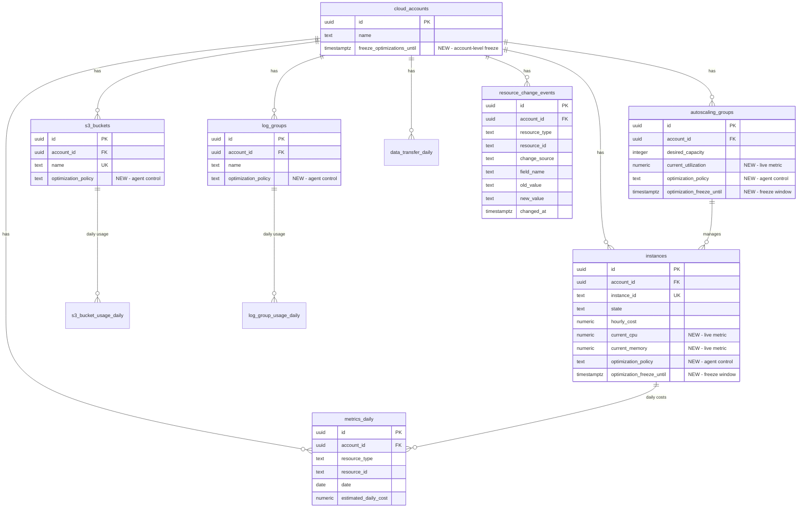

# feat: Implement drift-tick Supabase Edge Function

## Overview

Implement the `drift-tick` Supabase Edge Function - a "world simulator" that makes the simulated AWS environment evolve realistically so the agentic AI platform always has meaningful cost optimization work to do.

The function runs every 5-10 minutes (scheduled via pg_cron) and simulates ONE "virtual day" of cloud activity for every cloud account. It appends historical data to daily metrics tables, updates live utilization fields, and occasionally introduces realistic "startup mess" scenarios.

## Problem Statement / Motivation

The agentic AI platform for cloud cost optimization needs a dynamic environment to operate on:

1. **Continuous monitoring model** - needs evolving utilization data to analyze trends
2. **Auto-optimization model** - needs waste patterns to detect and fix automatically
3. **Recommendation model** - needs cost inefficiencies to propose optimizations for

Without drift-tick, the seeded data remains static, and the AI has nothing to optimize after initial cleanup. The drift engine ensures there's always new work: costs that creep up, preview environments that get forgotten, ASGs that get over-provisioned, and logs that accumulate.

## Technical Considerations

### Architecture Impacts

- New Supabase Edge Function: `supabase/functions/drift-tick/index.ts`
- New database migration for missing columns and tables
- pg_cron job for scheduling

### Schema Changes Required

**Migration 1: Add live utilization columns to instances**
```sql
ALTER TABLE instances
ADD COLUMN current_cpu numeric(5,2) DEFAULT 0,
ADD COLUMN current_memory numeric(5,2) DEFAULT 0;
```

**Migration 2: Add current_utilization to autoscaling_groups**
```sql
ALTER TABLE autoscaling_groups
ADD COLUMN current_utilization numeric(5,2) DEFAULT 0;
```

**Migration 3: Add optimization_policy to resources**

This column enables the agent models to know what actions they're allowed to take:
- `auto_safe` - Auto-optimization model can act without human approval
- `recommend_only` - Only recommend changes, require human approval
- `ignore` - Don't touch this resource at all

```sql
-- Per-resource optimization policy for agent behavior control
ALTER TABLE instances
ADD COLUMN optimization_policy text DEFAULT 'auto_safe'
  CHECK (optimization_policy IN ('auto_safe', 'recommend_only', 'ignore'));

ALTER TABLE autoscaling_groups
ADD COLUMN optimization_policy text DEFAULT 'recommend_only'
  CHECK (optimization_policy IN ('auto_safe', 'recommend_only', 'ignore'));

ALTER TABLE s3_buckets
ADD COLUMN optimization_policy text DEFAULT 'auto_safe'
  CHECK (optimization_policy IN ('auto_safe', 'recommend_only', 'ignore'));

ALTER TABLE log_groups
ADD COLUMN optimization_policy text DEFAULT 'auto_safe'
  CHECK (optimization_policy IN ('auto_safe', 'recommend_only', 'ignore'));

ALTER TABLE rds_instances
ADD COLUMN optimization_policy text DEFAULT 'recommend_only'
  CHECK (optimization_policy IN ('auto_safe', 'recommend_only', 'ignore'));

-- Comment explaining usage
COMMENT ON COLUMN instances.optimization_policy IS 'Controls agent behavior: auto_safe=agent can optimize, recommend_only=needs approval, ignore=hands off';
```

**Migration 4: Add optimization freeze windows**

Allow business intent override - "we have a sale coming, don't touch prod right now":

```sql
-- Account-level freeze for all resources
ALTER TABLE cloud_accounts
ADD COLUMN freeze_optimizations_until timestamptz;

-- Resource-level freeze for granular control
ALTER TABLE autoscaling_groups
ADD COLUMN optimization_freeze_until timestamptz;

ALTER TABLE instances
ADD COLUMN optimization_freeze_until timestamptz;

-- Comment explaining usage
COMMENT ON COLUMN cloud_accounts.freeze_optimizations_until IS 'If NOW() < this timestamp, agent should only warn, not modify any resources';
COMMENT ON COLUMN autoscaling_groups.optimization_freeze_until IS 'If NOW() < this timestamp, agent should only warn, not modify this ASG';
```

**Migration 5: Create resource_change_events table**
```sql
CREATE TABLE resource_change_events (
  id uuid PRIMARY KEY DEFAULT gen_random_uuid(),
  account_id uuid NOT NULL REFERENCES cloud_accounts(id) ON DELETE CASCADE,
  resource_type text NOT NULL,
  resource_id text NOT NULL,
  change_source text NOT NULL CHECK (change_source IN ('drift_engine', 'agent', 'manual')),
  field_name text NOT NULL,
  old_value text,
  new_value text,
  changed_at timestamptz NOT NULL DEFAULT now()
);

CREATE INDEX idx_resource_change_events_account ON resource_change_events(account_id);
CREATE INDEX idx_resource_change_events_resource ON resource_change_events(resource_type, resource_id);
CREATE INDEX idx_resource_change_events_time ON resource_change_events(changed_at DESC);
```

### Performance Implications

- Batch inserts (500 rows per batch) to avoid timeout
- Single pass through each resource type per tick
- Expected execution time: <10 seconds for ~100 resources

### Security Considerations

- Uses `SUPABASE_SERVICE_ROLE_KEY` (bypasses RLS) - stored as Supabase secret
- Function is not publicly accessible without authorization header
- No user data exposure risk (simulated data only)

## Proposed Solution

### Edge Function Structure

```
supabase/
  functions/
    drift-tick/
      index.ts          # Main entry point
    _shared/
      supabaseAdmin.ts  # Service role client
      cors.ts           # CORS headers
```

### Core Algorithm

```
For each cloud account:
  1. Determine next virtual day:
     - Query MAX(date) from metrics_daily for this account
     - If no data exists, skip account (requires seed data)
     - nextDate = lastDate + 1 day

  2. Append instance cost history (metrics_daily):
     - For each running instance:
       - Get yesterday's cost or compute from hourly_cost * 24
       - Apply random walk: [-3%, +5%] with prod bias (+2%)
       - Apply weekend adjustment (non-prod: 0.7-0.85x)
       - INSERT INTO metrics_daily

  3. Append S3 usage history (s3_bucket_usage_daily):
     - For each bucket:
       - Get yesterday's usage or initialize (50-500 GB)
       - Apply daily growth (prod: 1-3%, non-prod: 0.3-1.5%)
       - If lifecycle_policy exists, move storage between tiers
       - Calculate costs and INSERT

  4. Append log usage history (log_group_usage_daily):
     - For each log group:
       - Simulate daily ingest (prod: 0.5-3 GB, non-prod: 0.1-0.8 GB)
       - Apply weekend reduction (30% less)
       - Apply retention cap to stored_gb
       - Calculate costs and INSERT

  5. Append data transfer (data_transfer_daily):
     - Generate 2-3 transfer records:
       - Cross-region: us-east-1 → us-west-2, 5-50 GB
       - Internet egress: us-east-1 → internet, 20-200 GB
       - Calculate costs and INSERT

  6. Update live utilization (instances table):
     - For each running instance:
       - Set current_cpu based on env and weekend
       - Set current_memory similarly
       - UPDATE instances SET current_cpu, current_memory

  7. Introduce startup mess (5-10% probability):
     - Forgotten preview environment:
       - Create ASG with env='preview', 4-8 instances
       - Create associated instances
       - Optionally create log group and S3 bucket
     - Over-provisioned ASG:
       - Pick non-prod ASG
       - Increase desired_capacity by 1-2
       - Log to resource_change_events

  8. Return response: { ok: true, simulatedDate, accountsProcessed }
```

## Implementation Phases

### Phase 1: Foundation

**Tasks:**
- [ ] Create database migration for live utilization columns (`current_cpu`, `current_memory`, `current_utilization`)
- [ ] Create database migration for `optimization_policy` column on resources
- [ ] Create database migration for `optimization_freeze_until` columns
- [ ] Create database migration for `resource_change_events` table
- [ ] Create `supabase/functions/drift-tick/index.ts` skeleton
- [ ] Create `supabase/functions/_shared/supabaseAdmin.ts`
- [ ] Create `supabase/functions/_shared/cors.ts`
- [ ] Implement helper functions (date formatting, random utils, cost calculations)

**Files to create/modify:**
- `supabase/migrations/20260117000000_add_drift_columns.sql` (live metrics)
- `supabase/migrations/20260117000001_add_optimization_policy.sql` (agent control)
- `supabase/migrations/20260117000002_add_optimization_freeze.sql` (freeze windows)
- `supabase/migrations/20260117000003_create_resource_change_events.sql`
- `supabase/functions/drift-tick/index.ts`
- `supabase/functions/_shared/supabaseAdmin.ts`
- `supabase/functions/_shared/cors.ts`

**Success criteria:**
- Migrations run successfully
- Edge function skeleton deploys and returns health check

### Phase 2: Core Drift Simulation

**Tasks:**
- [ ] Implement `determineNextVirtualDay()` - query latest date from metrics_daily
- [ ] Implement `driftInstanceCosts()` - append to metrics_daily with random walk
- [ ] Implement `driftS3Usage()` - append to s3_bucket_usage_daily with growth
- [ ] Implement `driftLogUsage()` - append to log_group_usage_daily
- [ ] Implement `driftDataTransfer()` - append to data_transfer_daily
- [ ] Implement `updateLiveUtilization()` - UPDATE instances with current metrics

**Files to modify:**
- `supabase/functions/drift-tick/index.ts`

**Success criteria:**
- Running function appends exactly one day of data to all *_daily tables
- Daily cost values follow specified random walk patterns
- Weekend adjustments are applied correctly

### Phase 3: Startup Mess Scenarios

**Tasks:**
- [ ] Implement `createForgottenPreviewEnvironment()` - create ASG + instances
- [ ] Implement `overProvisionRandomAsg()` - increase ASG capacity
- [ ] Implement `logResourceChangeEvent()` - record changes
- [ ] Add probability gates (5-10% per scenario per tick)

**Files to modify:**
- `supabase/functions/drift-tick/index.ts`

**Success criteria:**
- Preview environments created occasionally with proper env/tags
- ASG over-provisioning logged to resource_change_events
- No mess introduced if random check fails

### Phase 4: Scheduling & Polish

**Tasks:**
- [ ] Create pg_cron schedule SQL for 5-10 minute intervals
- [ ] Add comprehensive logging (account processed, rows appended, scenarios triggered)
- [ ] Add error handling with proper HTTP status codes
- [ ] Test idempotency (running twice for same date should skip gracefully)

**Files to create/modify:**
- `supabase/migrations/20260117000002_schedule_drift_tick.sql`
- `supabase/functions/drift-tick/index.ts`

**Success criteria:**
- Function runs on schedule without manual invocation
- Duplicate runs don't create duplicate data
- Errors return HTTP 500 with clear error message

## Acceptance Criteria

### Functional Requirements

- [ ] Function determines next virtual day from metrics_daily MAX(date)
- [ ] Appends one row per running instance to metrics_daily
- [ ] Appends one row per S3 bucket to s3_bucket_usage_daily
- [ ] Appends one row per log group to log_group_usage_daily
- [ ] Appends 2-3 rows to data_transfer_daily per account
- [ ] Updates current_cpu and current_memory on all running instances
- [ ] Never modifies or deletes past rows (append-only)
- [ ] Respects agent changes (uses current world state as baseline)
- [ ] Creates preview environment stack at ~5-10% probability
- [ ] Over-provisions random ASG at ~5-10% probability
- [ ] Logs changes to resource_change_events with change_source='drift_engine'

### Non-Functional Requirements

- [ ] Execution completes in <10 seconds for typical workload
- [ ] Handles concurrent invocations gracefully (no duplicate data)
- [ ] Uses service role key from environment variables
- [ ] Logs structured JSON with virtual date and row counts
- [ ] Returns JSON response: `{ ok: true, simulatedDate, accountsProcessed }`
- [ ] Returns HTTP 500 with `{ ok: false, error }` on failure

### Quality Gates

- [ ] Function deploys successfully with `supabase functions deploy drift-tick`
- [ ] Manual invocation works via cURL with Authorization header
- [ ] Cron schedule activates and runs on interval
- [ ] No TypeScript/Deno compilation errors

## Success Metrics

1. **Data Growth**: Each tick adds exactly 1 virtual day of data
2. **Cost Realism**: Daily costs follow expected patterns (±10% variance, weekend dips)
3. **Waste Introduction**: New waste patterns appear every ~10-20 ticks
4. **Agent Compatibility**: Agent can read current_cpu/current_memory for real-time decisions

## Dependencies & Prerequisites

### Prerequisites

1. Supabase project with Edge Functions enabled
2. Database seeded with initial 30 days of data (via seed.ts)
3. Environment variables configured:
   - `SUPABASE_URL`
   - `SUPABASE_SERVICE_ROLE_KEY`

### Dependencies

- `@supabase/supabase-js@2` (via npm: specifier)
- Deno runtime (Supabase Edge Functions standard)

### Related Work

- Seed script: `scripts/seed.ts` (provides initial data patterns to mimic)
- Schema migrations: `supabase/migrations/*.sql`

## Risk Analysis & Mitigation

| Risk | Probability | Impact | Mitigation |
|------|-------------|--------|------------|
| Concurrent execution creates duplicates | Medium | Medium | Use INSERT ON CONFLICT DO NOTHING |
| Function timeout on large datasets | Low | High | Batch inserts (500 rows), limit accounts per run |
| Agent changes overwritten by drift | Medium | High | Only update "driftable" fields, never config |
| Clock skew causes date confusion | Low | Low | Use database NOW() for dates, not JavaScript |
| Service role key exposed | Low | Critical | Store in Supabase secrets, never hardcode |

## Future Considerations

1. **Multi-account parallelization**: Process accounts concurrently for scale
2. **Configurable drift intensity**: Allow tuning of variance and mess probability
3. **Resource type expansion**: Add drift for RDS, Lambda, Cache clusters
4. **Seasonal patterns**: Business hours, month-end spikes, holiday reductions
5. **Data archival**: Age out old *_daily data to separate tables

## Code Examples

### Main Handler Structure

```typescript
// supabase/functions/drift-tick/index.ts
import { createClient } from 'npm:@supabase/supabase-js@2'

Deno.serve(async (req: Request) => {
  const supabase = createClient(
    Deno.env.get('SUPABASE_URL')!,
    Deno.env.get('SUPABASE_SERVICE_ROLE_KEY')!
  )

  try {
    // 1. Get all cloud accounts
    const { data: accounts } = await supabase
      .from('cloud_accounts')
      .select('id')

    if (!accounts?.length) {
      return new Response(JSON.stringify({ ok: true, accountsProcessed: 0 }), {
        headers: { 'Content-Type': 'application/json' }
      })
    }

    let simulatedDate: string | null = null

    for (const account of accounts) {
      const result = await processAccount(supabase, account.id)
      if (result.simulatedDate) simulatedDate = result.simulatedDate
    }

    return new Response(JSON.stringify({
      ok: true,
      simulatedDate,
      accountsProcessed: accounts.length
    }), {
      headers: { 'Content-Type': 'application/json' }
    })

  } catch (error) {
    console.error('drift-tick error:', error)
    return new Response(JSON.stringify({ ok: false, error: error.message }), {
      status: 500,
      headers: { 'Content-Type': 'application/json' }
    })
  }
})
```

### Cost Calculation Constants

```typescript
// Pricing constants ($/day approximations)
const PRICING = {
  S3_STANDARD_PER_GB: 0.023 / 30,    // $0.023/GB/month
  S3_IA_PER_GB: 0.0125 / 30,         // $0.0125/GB/month
  S3_GLACIER_PER_GB: 0.004 / 30,     // $0.004/GB/month
  LOG_INGEST_PER_GB: 0.50,           // $0.50/GB
  LOG_STORAGE_PER_GB: 0.03 / 30,     // $0.03/GB/month
  DATA_TRANSFER_CROSS_REGION: 0.02,  // $0.02/GB
  DATA_TRANSFER_EGRESS: 0.09,        // $0.09/GB
}
```

### Random Walk Helper

```typescript
function applyRandomWalk(
  baseValue: number,
  minDelta: number,
  maxDelta: number,
  biasPercent: number = 0
): number {
  const delta = (Math.random() * (maxDelta - minDelta) + minDelta) / 100
  const biasMultiplier = 1 + (biasPercent / 100)
  return baseValue * (1 + delta) * biasMultiplier
}

// Usage: cost grows by -3% to +5%, with +2% bias for prod
const newCost = applyRandomWalk(yesterdayCost, -3, 5, isProd ? 2 : 0)
```

## Database Migration: Add Drift Columns

```sql
-- supabase/migrations/20260117000000_add_drift_columns.sql

-- Add live utilization columns to instances
ALTER TABLE instances
ADD COLUMN IF NOT EXISTS current_cpu numeric(5,2) DEFAULT 0,
ADD COLUMN IF NOT EXISTS current_memory numeric(5,2) DEFAULT 0;

-- Add current utilization to autoscaling_groups
ALTER TABLE autoscaling_groups
ADD COLUMN IF NOT EXISTS current_utilization numeric(5,2) DEFAULT 0;

-- Add index for efficient live metric queries
CREATE INDEX IF NOT EXISTS idx_instances_current_metrics
ON instances(account_id, state)
WHERE state = 'running';
```

## Database Migration: Optimization Policy

```sql
-- supabase/migrations/20260117000001_add_optimization_policy.sql

-- Per-resource optimization policy for agent behavior control
-- Values: 'auto_safe' | 'recommend_only' | 'ignore'

ALTER TABLE instances
ADD COLUMN IF NOT EXISTS optimization_policy text DEFAULT 'auto_safe'
  CHECK (optimization_policy IN ('auto_safe', 'recommend_only', 'ignore'));

ALTER TABLE autoscaling_groups
ADD COLUMN IF NOT EXISTS optimization_policy text DEFAULT 'recommend_only'
  CHECK (optimization_policy IN ('auto_safe', 'recommend_only', 'ignore'));

ALTER TABLE s3_buckets
ADD COLUMN IF NOT EXISTS optimization_policy text DEFAULT 'auto_safe'
  CHECK (optimization_policy IN ('auto_safe', 'recommend_only', 'ignore'));

ALTER TABLE log_groups
ADD COLUMN IF NOT EXISTS optimization_policy text DEFAULT 'auto_safe'
  CHECK (optimization_policy IN ('auto_safe', 'recommend_only', 'ignore'));

ALTER TABLE rds_instances
ADD COLUMN IF NOT EXISTS optimization_policy text DEFAULT 'recommend_only'
  CHECK (optimization_policy IN ('auto_safe', 'recommend_only', 'ignore'));

-- Index for filtering by policy
CREATE INDEX IF NOT EXISTS idx_instances_optimization_policy ON instances(optimization_policy);
CREATE INDEX IF NOT EXISTS idx_asg_optimization_policy ON autoscaling_groups(optimization_policy);

-- Comments explaining usage
COMMENT ON COLUMN instances.optimization_policy IS 'Controls agent behavior: auto_safe=agent can optimize, recommend_only=needs approval, ignore=hands off';
COMMENT ON COLUMN autoscaling_groups.optimization_policy IS 'Controls agent behavior: auto_safe=agent can optimize, recommend_only=needs approval, ignore=hands off';
```

## Database Migration: Optimization Freeze Windows

```sql
-- supabase/migrations/20260117000002_add_optimization_freeze.sql

-- Allow business intent override - "don't touch prod during sale"

-- Account-level freeze for all resources
ALTER TABLE cloud_accounts
ADD COLUMN IF NOT EXISTS freeze_optimizations_until timestamptz;

-- Resource-level freeze for granular control
ALTER TABLE autoscaling_groups
ADD COLUMN IF NOT EXISTS optimization_freeze_until timestamptz;

ALTER TABLE instances
ADD COLUMN IF NOT EXISTS optimization_freeze_until timestamptz;

-- Index for efficient freeze checking
CREATE INDEX IF NOT EXISTS idx_accounts_freeze ON cloud_accounts(freeze_optimizations_until)
WHERE freeze_optimizations_until IS NOT NULL;

CREATE INDEX IF NOT EXISTS idx_asg_freeze ON autoscaling_groups(optimization_freeze_until)
WHERE optimization_freeze_until IS NOT NULL;

-- Comments explaining usage
COMMENT ON COLUMN cloud_accounts.freeze_optimizations_until IS 'If NOW() < this timestamp, agent should only warn, not modify any resources';
COMMENT ON COLUMN autoscaling_groups.optimization_freeze_until IS 'If NOW() < this timestamp, agent should only warn, not modify this ASG';
COMMENT ON COLUMN instances.optimization_freeze_until IS 'If NOW() < this timestamp, agent should only warn, not modify this instance';
```

## Database Migration: Resource Change Events

```sql
-- supabase/migrations/20260117000003_create_resource_change_events.sql

CREATE TABLE IF NOT EXISTS resource_change_events (
  id uuid PRIMARY KEY DEFAULT gen_random_uuid(),
  account_id uuid NOT NULL REFERENCES cloud_accounts(id) ON DELETE CASCADE,
  resource_type text NOT NULL,
  resource_id text NOT NULL,
  change_source text NOT NULL CHECK (change_source IN ('drift_engine', 'agent', 'manual')),
  field_name text NOT NULL,
  old_value text,
  new_value text,
  changed_at timestamptz NOT NULL DEFAULT now()
);

CREATE INDEX idx_resource_change_events_account ON resource_change_events(account_id);
CREATE INDEX idx_resource_change_events_resource ON resource_change_events(resource_type, resource_id);
CREATE INDEX idx_resource_change_events_time ON resource_change_events(changed_at DESC);

ALTER TABLE resource_change_events ENABLE ROW LEVEL SECURITY;

COMMENT ON TABLE resource_change_events IS 'Audit log of all resource changes by drift engine, agent, or manual actions';
```

## pg_cron Schedule

```sql
-- supabase/migrations/20260117000002_schedule_drift_tick.sql

-- Enable required extensions
CREATE EXTENSION IF NOT EXISTS pg_net;
CREATE EXTENSION IF NOT EXISTS pg_cron;

-- Schedule drift-tick to run every 5 minutes
SELECT cron.schedule(
  'drift-tick-simulator',
  '*/5 * * * *',  -- Every 5 minutes
  $$
  SELECT net.http_post(
    url := (SELECT decrypted_secret FROM vault.decrypted_secrets WHERE name = 'project_url')
           || '/functions/v1/drift-tick',
    headers := jsonb_build_object(
      'Content-Type', 'application/json',
      'Authorization', 'Bearer ' || (SELECT decrypted_secret FROM vault.decrypted_secrets WHERE name = 'service_role_key')
    ),
    body := jsonb_build_object('triggered_by', 'pg_cron'),
    timeout_milliseconds := 60000
  ) AS request_id;
  $$
);
```

## Agent Behavior Control

### Optimization Policy Values

The `optimization_policy` column on resources controls what the agent can do:

| Policy | Auto-Optimization Model | Recommendation Model | Monitoring Model |
|--------|------------------------|---------------------|------------------|
| `auto_safe` | Can act without approval | Can recommend | Watches |
| `recommend_only` | Cannot act, only recommend | Can recommend, needs approval | Watches |
| `ignore` | Hands off completely | No recommendations | Still watches (anomaly detection) |

**Default policies by resource type:**
- `instances` - `auto_safe` (dev/staging can be auto-optimized)
- `autoscaling_groups` - `recommend_only` (ASG changes are risky)
- `s3_buckets` - `auto_safe` (lifecycle policies are safe)
- `log_groups` - `auto_safe` (retention changes are safe)
- `rds_instances` - `recommend_only` (database changes need approval)

### Freeze Window Logic

Before taking any action, agents should check:

```sql
-- Check if frozen at account level
SELECT freeze_optimizations_until > NOW() AS is_frozen
FROM cloud_accounts WHERE id = :account_id;

-- Check if frozen at resource level
SELECT optimization_freeze_until > NOW() AS is_frozen
FROM autoscaling_groups WHERE id = :asg_id;
```

If frozen:
- **Auto-optimization model**: Skip this resource, log warning
- **Recommendation model**: Can still generate recommendations, but mark as "frozen until X"
- **Monitoring model**: Continue monitoring, flag if freeze is about to expire

### Demo Scenario

"Look, dev/preview is auto-optimized, but prod only gets recommendations":

```sql
-- Set prod instances to recommend-only
UPDATE instances SET optimization_policy = 'recommend_only' WHERE env = 'prod';

-- Set dev/preview to auto-safe
UPDATE instances SET optimization_policy = 'auto_safe' WHERE env IN ('dev', 'preview');

-- Freeze prod ASGs during Black Friday sale
UPDATE autoscaling_groups
SET optimization_freeze_until = '2024-12-01 00:00:00'
WHERE env = 'prod';
```

## ERD: Drift Engine Data Flow



## References

### Internal References

- Schema overview: `plans/aws-cloud-environment-supabase-schema.md`
- Seed script patterns: `scripts/seed.ts`
- Compute tables: `supabase/migrations/20260116062426_create_compute_tables.sql`
- Storage tables: `supabase/migrations/20260116062457_create_storage_tables.sql`
- Observability tables: `supabase/migrations/20260116062800_create_observability_tables.sql`
- Networking tables: `supabase/migrations/20260116062753_create_networking_tables.sql`
- Governance tables: `supabase/migrations/20260116062802_create_governance_tables.sql`

### External References

- Supabase Edge Functions: https://supabase.com/docs/guides/functions
- Supabase Scheduling with pg_cron: https://supabase.com/docs/guides/functions/schedule-functions
- Deno serve API: https://docs.deno.com/api/deno/~/Deno.serve
- AWS pricing reference (for cost constants): https://aws.amazon.com/pricing/
