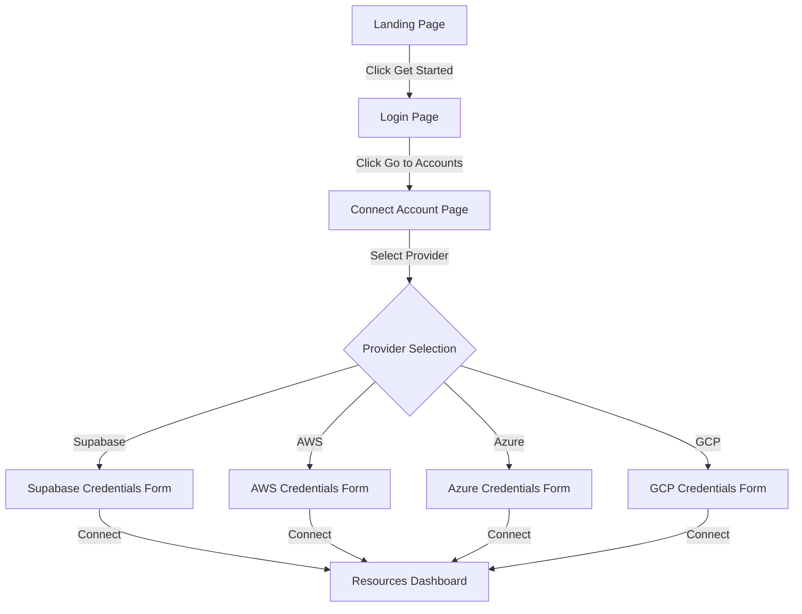
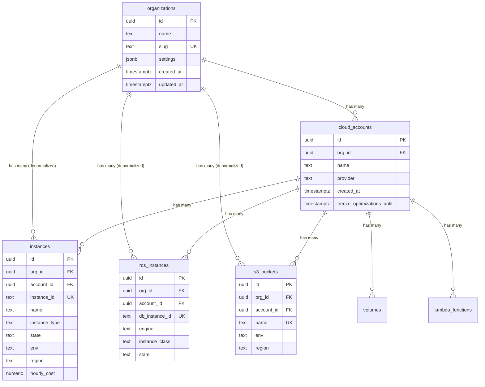

# feat: Multi-Tenant Organization → Account → Resource Hierarchy

**Date**: 2025-01-19
**Type**: Feature Enhancement
**Priority**: High
**Estimated Complexity**: Large (schema migration + frontend + seeding)

---

## Overview

Transform the current single-tenant data model into a multi-tenant hierarchy where:

```
Organization (e.g., Cisco, Amazon)
    └── Cloud Accounts (e.g., erp-prod, erp-dev, website-prod)
            └── Resources (EC2, RDS, S3, Lambda, etc.)
```

**Current State**: Single `cloud_accounts` table as top-level entity with all 27+ resource tables referencing it via `account_id`.

**Target State**: New `organizations` table at top-level, with `cloud_accounts` belonging to organizations, and all resources having both `org_id` and `account_id` for efficient Row-Level Security (RLS).

---

## Problem Statement / Motivation

The current data model assumes "one client with one AWS account" which doesn't reflect real enterprise structures:

- Large enterprises (Cisco, Amazon) have multiple AWS accounts for different applications/environments
- Each AWS account has its own set of resources
- Organizations need to view and manage resources across all their accounts
- RLS policies need efficient org-level filtering without expensive JOINs

---

## Proposed Solution

### Database Changes

1. **Create `organizations` table** - Top-level tenant entity
2. **Add `org_id` to `cloud_accounts`** - Each account belongs to an org
3. **Add `org_id` to all 27+ resource tables** - Denormalized for RLS performance
4. **Create comprehensive seed data** - 5-10 orgs with varied account/resource distributions

### Frontend Changes

1. **Organization selector** - Global org context in navbar
2. **Account list view** - View/manage accounts within selected org
3. **Resource views** - Filter by org context, show all accounts or specific account

---

## Technical Approach

### Phase 1: Database Schema Changes

#### 1.1 Create Organizations Table

**File**: `aws-environment/supabase/migrations/20250119000001_create_organizations.sql`

```sql
-- =============================================================================
-- ORGANIZATIONS TABLE
-- =============================================================================
CREATE TABLE organizations (
    id UUID PRIMARY KEY DEFAULT gen_random_uuid(),
    name TEXT NOT NULL,
    slug TEXT NOT NULL UNIQUE,  -- URL-friendly identifier (e.g., 'cisco', 'amazon')
    settings JSONB DEFAULT '{}',
    created_at TIMESTAMPTZ NOT NULL DEFAULT NOW(),
    updated_at TIMESTAMPTZ NOT NULL DEFAULT NOW()
);

COMMENT ON TABLE organizations IS 'Top-level tenant entity representing a company/organization';

CREATE INDEX idx_organizations_slug ON organizations(slug);

ALTER TABLE organizations ENABLE ROW LEVEL SECURITY;

-- RLS Policy: Anyone can read organizations (public info)
CREATE POLICY "Organizations are publicly readable"
ON organizations FOR SELECT
USING (true);
```

#### 1.2 Add org_id to cloud_accounts

**File**: `aws-environment/supabase/migrations/20250119000002_add_org_id_to_accounts.sql`

```sql
-- =============================================================================
-- ADD ORGANIZATION RELATIONSHIP TO CLOUD_ACCOUNTS
-- =============================================================================

-- Step 1: Add nullable column first (non-blocking)
ALTER TABLE cloud_accounts
ADD COLUMN org_id UUID;

-- Step 2: Add foreign key constraint (NOT VALID for non-blocking)
ALTER TABLE cloud_accounts
ADD CONSTRAINT fk_cloud_accounts_org
FOREIGN KEY (org_id) REFERENCES organizations(id) ON DELETE CASCADE
NOT VALID;

-- Step 3: Add composite unique constraint for resource FKs later
ALTER TABLE cloud_accounts
ADD CONSTRAINT cloud_accounts_org_id_id_unique
UNIQUE (org_id, id);

-- Index for org-scoped queries
CREATE INDEX idx_cloud_accounts_org_id ON cloud_accounts(org_id);
```

#### 1.3 Add org_id to All Resource Tables

**File**: `aws-environment/supabase/migrations/20250119000003_add_org_id_to_resources.sql`

Add `org_id` column to all 20+ resource tables:

- `instances`
- `volumes`
- `snapshots`
- `s3_buckets`
- `rds_instances`
- `cache_clusters`
- `lambda_functions`
- `load_balancers`
- `elastic_ips`
- `container_clusters`
- `container_nodes` (via cluster)
- `container_services` (via cluster)
- `autoscaling_groups`
- `log_groups`
- `streaming_clusters`
- `managed_services`
- `commitments`
- `data_transfer_daily`
- `metrics_daily`
- `resource_change_events`
- `resource_tags`
- `api_clients`
- `s3_bucket_usage_daily` (via bucket)
- `log_group_usage_daily` (via log_group)
- `commitment_utilization_daily` (via commitment)

```sql
-- Template for each resource table:
ALTER TABLE {table_name} ADD COLUMN org_id UUID;

ALTER TABLE {table_name}
ADD CONSTRAINT fk_{table_name}_org
FOREIGN KEY (org_id) REFERENCES organizations(id) ON DELETE CASCADE
NOT VALID;

CREATE INDEX idx_{table_name}_org_id ON {table_name}(org_id);
```

#### 1.4 Backfill Migration

**File**: `aws-environment/supabase/migrations/20250119000004_backfill_org_id.sql`

```sql
-- =============================================================================
-- BACKFILL ORGANIZATION DATA
-- =============================================================================

-- Create default organization for existing data
INSERT INTO organizations (id, name, slug)
VALUES ('00000000-0000-0000-0000-000000000001', 'Acme Corp', 'acme-corp')
ON CONFLICT (slug) DO NOTHING;

-- Backfill cloud_accounts
UPDATE cloud_accounts
SET org_id = '00000000-0000-0000-0000-000000000001'
WHERE org_id IS NULL;

-- Validate and finalize constraint
ALTER TABLE cloud_accounts VALIDATE CONSTRAINT fk_cloud_accounts_org;
ALTER TABLE cloud_accounts ALTER COLUMN org_id SET NOT NULL;

-- Backfill all resource tables (derive org_id from account_id)
UPDATE instances i
SET org_id = ca.org_id
FROM cloud_accounts ca
WHERE i.account_id = ca.id AND i.org_id IS NULL;

-- Repeat for all 20+ resource tables...
-- (Full script will iterate through all tables)

-- Finalize all constraints
ALTER TABLE instances ALTER COLUMN org_id SET NOT NULL;
-- ... repeat for all tables
```

### Phase 2: Seed Data

**File**: `aws-environment/scripts/seed-multi-tenant.ts`

Create realistic multi-tenant seed data:

| Organization | Slug | Type | Accounts | Resources/Account |
|--------------|------|------|----------|-------------------|
| Cisco Systems | cisco | Large Enterprise | 8-10 | 50-100 |
| Amazon Tech | amazon | Large Enterprise | 6-8 | 40-80 |
| Netflix Streaming | netflix | Large | 5-6 | 30-60 |
| Stripe Payments | stripe | Medium | 4-5 | 20-40 |
| Spotify Audio | spotify | Medium | 3-4 | 15-30 |
| Datadog Monitoring | datadog | Medium | 3-4 | 15-30 |
| Vercel Deploy | vercel | Small | 2-3 | 10-20 |
| Linear PM | linear | Small | 2 | 5-15 |
| Acme Startup | acme | Small | 1-2 | 5-10 |

**Account Naming Convention per Org**:
- `{app}-prod` (e.g., erp-prod, website-prod)
- `{app}-staging`
- `{app}-dev`
- `data-warehouse`
- `analytics`
- `shared-services`

### Phase 3: Frontend User Flow

The new user journey will follow this flow:

```
Landing Page → Login Page → Connect Account Page → Resources Dashboard
```

#### 3.1 User Flow Diagram



#### 3.2 Landing Page (Static)

**File**: `agentic-ai-platform/app/page.tsx` (update existing or create new)

A simple, static landing page with one hero section:

```
┌─────────────────────────────────────────────────────────────┐
│                                                             │
│  ☁️ CloudOps AI Platform                                    │
│                                                             │
│  ┌─────────────────────────────────────────────────────┐   │
│  │                                                     │   │
│  │   Intelligent Cloud Cost Optimization               │   │
│  │                                                     │   │
│  │   Reduce your cloud spend by up to 40% with        │   │
│  │   AI-powered recommendations and automated          │   │
│  │   resource management.                              │   │
│  │                                                     │   │
│  │   [ Get Started ]                                   │   │
│  │                                                     │   │
│  └─────────────────────────────────────────────────────┘   │
│                                                             │
└─────────────────────────────────────────────────────────────┘
```

**Components**:
- Hero section with headline, subtext, and CTA button
- "Get Started" button navigates to `/login`

#### 3.3 Login Page (Static Placeholder)

**File**: `agentic-ai-platform/app/login/page.tsx`

A static login page with placeholder elements (not functional for now):

```
┌─────────────────────────────────────────────────────────────┐
│                                                             │
│  ☁️ CloudOps AI                                             │
│                                                             │
│  ┌─────────────────────────────────────────────────────┐   │
│  │                                                     │   │
│  │   Welcome Back                                      │   │
│  │                                                     │   │
│  │   Email                                             │   │
│  │   ┌─────────────────────────────────────────────┐  │   │
│  │   │ email@example.com                           │  │   │
│  │   └─────────────────────────────────────────────┘  │   │
│  │                                                     │   │
│  │   Password                                          │   │
│  │   ┌─────────────────────────────────────────────┐  │   │
│  │   │ ••••••••                                    │  │   │
│  │   └─────────────────────────────────────────────┘  │   │
│  │                                                     │   │
│  │   [ Go to Accounts → ]                              │   │
│  │                                                     │   │
│  │   Don't have an account? Sign up                    │   │
│  │                                                     │   │
│  └─────────────────────────────────────────────────────┘   │
│                                                             │
└─────────────────────────────────────────────────────────────┘
```

**Components**:
- Email input field (placeholder only)
- Password input field (placeholder only)
- "Go to Accounts" button navigates to `/accounts/connect`
- Sign up link (placeholder)

**Note**: Login functionality will be implemented later. For now, just the button to proceed.

#### 3.4 Connect Account Page

**File**: `agentic-ai-platform/app/accounts/connect/page.tsx`

A page where users select which cloud provider to connect:

```
┌─────────────────────────────────────────────────────────────┐
│                                                             │
│  ☁️ Connect Your Cloud Account                              │
│                                                             │
│  Select your cloud provider to get started                  │
│                                                             │
│  ┌───────────────┐  ┌───────────────┐  ┌───────────────┐   │
│  │               │  │               │  │               │   │
│  │   Supabase    │  │     AWS       │  │    Azure      │   │
│  │   (Database)  │  │  (Cloud)      │  │   (Cloud)     │   │
│  │               │  │               │  │               │   │
│  │  [ Connect ]  │  │  [ Connect ]  │  │  [ Connect ]  │   │
│  │               │  │               │  │               │   │
│  └───────────────┘  └───────────────┘  └───────────────┘   │
│                                                             │
│  ┌───────────────┐  ┌───────────────┐                      │
│  │               │  │               │                      │
│  │     GCP       │  │    Other      │                      │
│  │  (Cloud)      │  │  (Coming Soon)│                      │
│  │               │  │               │                      │
│  │  [ Connect ]  │  │  [ Disabled ] │                      │
│  │               │  │               │                      │
│  └───────────────┘  └───────────────┘                      │
│                                                             │
└─────────────────────────────────────────────────────────────┘
```

**Provider Cards**:
| Provider | Status | Description |
|----------|--------|-------------|
| Supabase | Active | Connect to Supabase database |
| AWS | Active | Connect AWS account |
| Azure | Active | Connect Azure subscription |
| GCP | Active | Connect Google Cloud project |
| Other | Disabled | Coming soon |

**On Click**: Shows a modal/form with credential inputs for that provider

#### 3.5 Supabase Connection Form (Modal/Inline)

When user clicks "Supabase", show the connection form (similar to current setup):

```
┌─────────────────────────────────────────────────────────────┐
│                                                             │
│  Connect to Supabase                                        │
│                                                             │
│  Supabase URL                                               │
│  ┌─────────────────────────────────────────────────────┐   │
│  │ https://xxxx.supabase.co                            │   │
│  └─────────────────────────────────────────────────────┘   │
│                                                             │
│  Anon Key                                                   │
│  ┌─────────────────────────────────────────────────────┐   │
│  │ eyJhbGciOiJIUzI1NiIsInR5cCI6IkpXVCJ9...             │   │
│  └─────────────────────────────────────────────────────┘   │
│                                                             │
│  Account Name (optional)                                    │
│  ┌─────────────────────────────────────────────────────┐   │
│  │ My Production Database                              │   │
│  └─────────────────────────────────────────────────────┘   │
│                                                             │
│  [ Cancel ]                    [ Connect & Continue ]       │
│                                                             │
└─────────────────────────────────────────────────────────────┘
```

**On Success**:
- Creates organization (if none exists)
- Creates cloud_account with org_id
- Redirects to `/resources` dashboard

#### 3.6 Resources Dashboard (Updated)

**File**: `agentic-ai-platform/app/resources/page.tsx` (update existing)

After connecting, user sees resources with org/account context:

```
┌─────────────────────────────────────────────────────────────┐
│  ☁️ CloudOps AI    │ Acme Corp ▼ │ erp-prod ▼ │  [Settings] │
├─────────────────────────────────────────────────────────────┤
│                                                             │
│  Resources Dashboard                                        │
│                                                             │
│  Organization: Acme Corp                                    │
│  Account: erp-prod (Supabase)                               │
│                                                             │
│  ┌──────────────────────────────────────────────────────┐  │
│  │  EC2 Instances (12)  │ RDS (3) │ S3 (8) │ Lambda (5) │  │
│  └──────────────────────────────────────────────────────┘  │
│                                                             │
│  ... resource list ...                                      │
│                                                             │
└─────────────────────────────────────────────────────────────┘
```

**Navbar Updates**:
- Organization selector dropdown (if multiple orgs)
- Account selector dropdown (if multiple accounts in org)

#### 3.7 Organization Selector Component

**File**: `agentic-ai-platform/components/org-selector.tsx`

```typescript
// Dropdown in navbar showing current organization
// Lists all organizations user has access to
// On change: updates localStorage, refreshes data
```

#### 3.8 Account Selector Component

**File**: `agentic-ai-platform/components/account-selector.tsx`

```typescript
// Dropdown showing accounts within selected organization
// Options: "All Accounts" or specific account
// On change: filters resources by account_id
```

#### 3.9 Update Resource Queries

Update all Supabase queries to include org_id filtering:

**File**: `agentic-ai-platform/lib/supabase/queries.ts`

```typescript
// Before:
const { data } = await supabase.from('instances').select('*');

// After:
const { data } = await supabase
  .from('instances')
  .select('*')
  .eq('org_id', currentOrgId);
```

---

## Acceptance Criteria

### Database Requirements

- [ ] New `organizations` table created with id, name, slug, settings, timestamps
- [ ] `cloud_accounts` has `org_id` FK to organizations with CASCADE delete
- [ ] All 27+ resource tables have `org_id` column with appropriate indexes
- [ ] Existing "Acme Corp" data migrated to default organization
- [ ] Composite indexes on (org_id, account_id) for query performance

### Frontend Requirements

- [ ] Static landing page with hero section and "Get Started" button
- [ ] Static login page with email/password placeholders and "Go to Accounts" button
- [ ] Connect Account page with provider cards (Supabase, AWS, Azure, GCP, Other)
- [ ] Supabase connection form works (same as current setup functionality)
- [ ] AWS/Azure/GCP connection forms as placeholders (not functional)
- [ ] After connecting, user is redirected to resources dashboard
- [ ] Navbar shows organization selector dropdown
- [ ] Navbar shows account selector dropdown
- [ ] Resource views filter by selected organization/account context

### Non-Functional Requirements

- [ ] Migration runs without data loss
- [ ] Database migration can be rolled back
- [ ] No orphaned resources (all have valid org_id)
- [ ] Frontend navigation flow works end-to-end

### Quality Gates

- [ ] All existing tests pass after migration
- [ ] User flow from landing → login → connect → resources works

---

## Database Schema (ERD)



---

## Implementation Files

### Database Migrations

| File | Purpose |
|------|---------|
| `aws-environment/supabase/migrations/20250119000001_create_organizations.sql` | Create organizations table |
| `aws-environment/supabase/migrations/20250119000002_add_org_id_to_accounts.sql` | Add org_id FK to cloud_accounts |
| `aws-environment/supabase/migrations/20250119000003_add_org_id_to_resources.sql` | Add org_id to all 27+ resource tables |
| `aws-environment/supabase/migrations/20250119000004_backfill_org_id.sql` | Backfill existing data and finalize constraints |
| `aws-environment/supabase/migrations/20250119000005_update_rls_policies.sql` | Update RLS policies for org filtering |

### Seed Scripts

| File | Purpose |
|------|---------|
| `aws-environment/scripts/seed-organizations.ts` | Seed 5-10 organizations |
| `aws-environment/scripts/seed-accounts.ts` | Seed accounts per organization |
| `aws-environment/scripts/seed-resources.ts` | Seed resources per account |

### Frontend - New Pages

| File | Purpose |
|------|---------|
| `agentic-ai-platform/app/page.tsx` | Landing page with hero section and "Get Started" CTA |
| `agentic-ai-platform/app/login/page.tsx` | Static login page with email/password placeholders |
| `agentic-ai-platform/app/accounts/connect/page.tsx` | Cloud provider selection page (Supabase, AWS, Azure, GCP) |

### Frontend - New Components

| File | Purpose |
|------|---------|
| `agentic-ai-platform/components/landing/hero.tsx` | Hero section for landing page |
| `agentic-ai-platform/components/auth/login-form.tsx` | Login form placeholder |
| `agentic-ai-platform/components/providers/provider-card.tsx` | Cloud provider selection card |
| `agentic-ai-platform/components/providers/supabase-connect-form.tsx` | Supabase connection form |
| `agentic-ai-platform/components/providers/aws-connect-form.tsx` | AWS connection form (placeholder) |
| `agentic-ai-platform/components/org-selector.tsx` | Global org selector dropdown |
| `agentic-ai-platform/components/account-selector.tsx` | Account selector dropdown |
| `agentic-ai-platform/hooks/use-org-context.ts` | React hook for org context |
| `agentic-ai-platform/lib/supabase/queries.ts` | Updated queries with org filtering |

### Updated Existing Files

| File | Change |
|------|--------|
| `agentic-ai-platform/components/navbar.tsx` | Add org selector and account selector |
| `agentic-ai-platform/app/resources/page.tsx` | Filter by org/account context |
| `agentic-ai-platform/app/monitoring/page.tsx` | Filter by org context |
| `agentic-ai-platform/app/approvals/page.tsx` | Filter by org context |
| `aws-environment/scripts/seed.ts` | Update to support multi-org

---

## Dependencies & Prerequisites

- Supabase CLI installed and configured
- Access to push migrations to database
- Existing data backup before migration
- Frontend development environment running

---

## Risk Analysis & Mitigation

| Risk | Impact | Mitigation |
|------|--------|------------|
| Data loss during migration | Critical | Full backup before migration, transaction-wrapped script |
| Orphaned resources (null org_id) | High | Validation queries after backfill, constraints prevent future orphans |
| Breaking existing queries | High | Update all queries with org_id filter, test thoroughly |
| Performance regression | Medium | Composite indexes on (org_id, account_id), RLS benchmark |
| Frontend context bugs | Medium | Comprehensive testing of org switching |

---

## Open Questions (Clarification Needed)

### Critical

1. **User-to-Organization Relationship**: Should users belong to multiple organizations? (Affects auth/RLS)
   - *Assumption*: Single org per user for MVP, no user-org junction table needed

2. **API Client Scoping**: How should API clients specify org context?
   - *Assumption*: API clients have org_id FK, scoped to single org

3. **Cascade Delete Behavior**: When org is deleted, delete all accounts/resources?
   - *Assumption*: Yes, CASCADE delete entire hierarchy

### Important

4. **URL Structure**: Should URLs include org slug? (e.g., `/org/cisco/resources`)
   - *Assumption*: No URL changes for MVP, org context stored in session

5. **Cross-Account Views**: Should users see all accounts in org at once, or one at a time?
   - *Assumption*: Org-wide aggregate view by default, optional account filter

---

## References & Research

### Internal References

- Current schema: `agentic-ai-platform/supabase/current schema`
- Existing migrations: `aws-environment/supabase/migrations/`
- Seed script: `aws-environment/scripts/seed.ts`
- Database docs: `aws-environment/docs/database-schema-optimization-guide.md`

### External References

- [Supabase Row Level Security](https://supabase.com/docs/guides/database/postgres/row-level-security)
- [Supabase Database Migrations](https://supabase.com/docs/guides/deployment/database-migrations)
- [PostgreSQL Foreign Keys](https://www.postgresql.org/docs/current/ddl-constraints.html#DDL-CONSTRAINTS-FK)
- [Multi-tenant PostgreSQL Patterns](https://www.crunchydata.com/blog/designing-your-postgres-database-for-multi-tenancy)

---

## MVP Scope

For the initial implementation, focus on:

1. **Database**: Create organizations table, add org_id to cloud_accounts and all resource tables, backfill existing data to "Acme Corp" org
2. **Frontend Flow**: Landing page → Login page → Connect Account page → Resources dashboard
3. **No RLS policies**: Skip Row-Level Security for now (implement later)
4. **No extra seed data**: Skip seeding 5-10 fake orgs for now (use existing Acme Corp data)
5. **No auth functionality**: Login page is static placeholder, "Go to Accounts" button just navigates

### Implementation Order

1. **Database migrations** (Phase 1)
   - Create organizations table
   - Add org_id to cloud_accounts
   - Add org_id to all resource tables
   - Backfill existing data

2. **Frontend pages** (Phase 3)
   - Landing page with hero section
   - Login page with placeholder form
   - Connect Account page with provider cards
   - Update navbar with org/account selectors

3. **Integration** (Final)
   - Connect Supabase form creates org + account
   - Resources page filters by org_id
   - Navigation flow works end-to-end

Future enhancements:
- User-organization membership with roles
- RLS policies for multi-org users
- Functional login with authentication
- AWS/Azure/GCP actual connection logic
- Seed data with multiple organizations
- API client org scoping
- Org-level settings and billing
